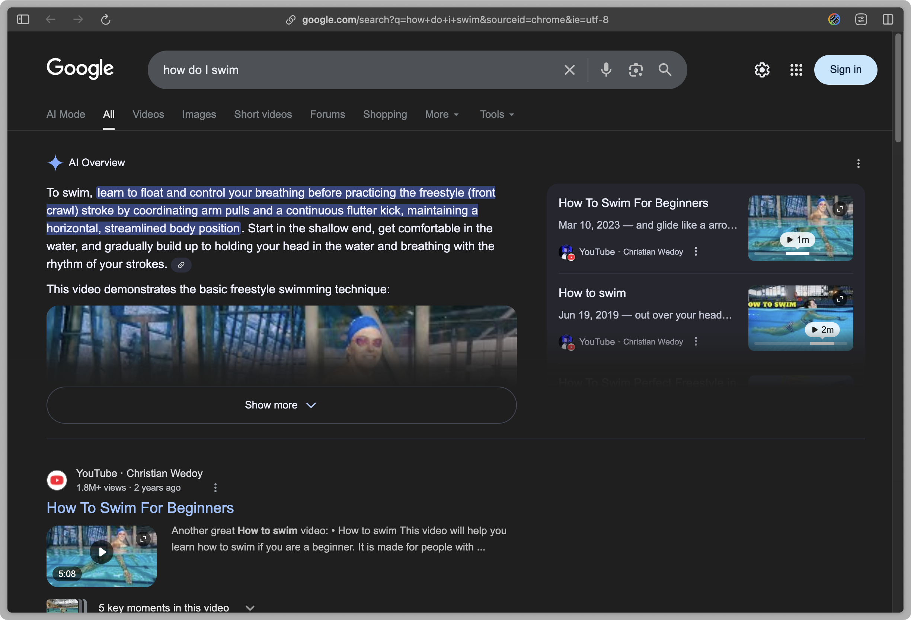
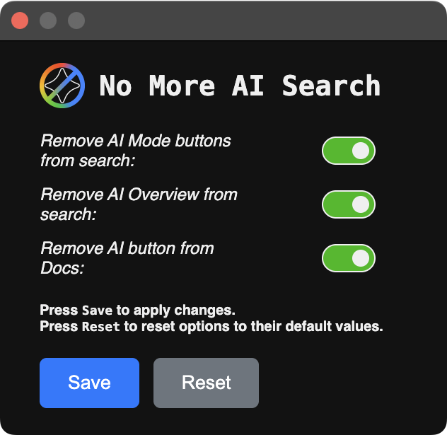

  
  
   
  <!---
    
    
  -->

 

  

<h3 align="center">
  <code>No More AI Search</code>
</h3>

<h6 align="center">
  forked by <a href="https://github.com/nickesc">nickesc</a> created by <a href="https://github.com/zbarnz">zbarnz</a>
</h6>

<!---

  
  

-->

## Overview

`No More AI Search` is a simple browser extension that attempts to remove AI results from Google Search results. Compatible with Chromium™ and Firefox based web browsers.

This extension is largely based on [zbarnz's](https://github.com/zbarnz) [Google AI Overview Blocker](https://github.com/zbarnz/Google_AI_Overviews_Blocker) extension. This version also blocks the AI Mode button in the Google Search toolbar, and allows you to enable or disable features with custom settings.

Without `No More AI Search` | With `No More AI Search`
-|-
|

## Options

Extension options can be accessed with the extension's Toolbar Button or the extension's settings page in `chrome://extensions` or `about:addons` > `No More AI Search` > `Extension Options`/`Preferences`

By checking or unchecking each of the options, you can enable or disable the features you want to use:

- Remove AI Mode buttons
- Remove AI Overview

<!---
## Installation

### Chromium™

- Download and install the extension from the [Chrome Web Store](https://chromewebstore.google.com/detail/no-more-ai-search)

### Firefox

- Download and install the extension from [addons.mozilla.org](https://addons.mozilla.org/en-US/firefox/addon/no-more-ai-search/)

### Manual

- Download and install the latest version of the extension for your browser from the [Releases](https://github.com/nickesc/no-more-ai-search/releases) page (`.crx` for Chromium™, `.xpi` for Firefox).
-->

## Privacy

`No More AI Search` does not collect or track any data.

## Attribution

- [zbarnz](https://github.com/zbarnz) is the creator of the original [Google AI Overview Blocker](https://github.com/zbarnz/Google_AI_Overviews_Blocker) extension.
- Chrome and Chromium are trademarks of Google LLC. Use of these trademarks is subject to Google Permissions.
- Firefox is a trademark of the Mozilla Foundation in the U.S. and other countries.

## License

`No More AI Search` is licensed under the `MIT License`. For more information, view the repository's [`LICENSE`](LICENSE) file.
